# **Hotel Network**

## **1\. Overview**

The hotel network is designed to support **administrative operations, staff connectivity, and guest services**.

* **Departments are isolated via VLANs** for security and manageability.

* **Each floor** contains a dedicated **switch and wireless access point**.

* **Core switches (MLSW1 & MLSW2)** provide inter-VLAN routing, redundancy, and centralized management.

## **2\. Core Infrastructure**

* **MLSW1 – Hotel Router (Core 1\)** → 172.17.0.0/30

* **MLSW2 – Hotel Router (Core 2\)** → 172.17.0.4/30

* Both are configured with **EtherChannel**, and **inter-VLAN routing**.

## **3\. VLAN & IP Addressing Scheme**

| Department / Purpose   | VLAN ID | Subnet         | Hosts |
|:-----------------------|:--------|:---------------|:------|
| Management             | 2       | 172.17.1.0/29  | 6     |
| Logistics              | 3       | 172.17.1.8/29  | 6     |
| Reception              | 4       | 172.17.1.16/29 | 6     |
| Human Resources        | 5       | 172.17.1.24/29 | 6     |
| Finance                | 6       | 172.17.1.32/29 | 6     |
| IT Department          | 7       | 172.17.1.40/29 | 6     |
| Kitchen                | 8       | 172.17.1.48/29 | 6     |
| Server Room            | 9       | 172.17.1.56/29 | 6     |
| Configuration          | 10      | 172.17.2.0/28  | 14    |
| WLAN (Staff \+ Guests) | 11      | 172.18.0.0/22  | 1022  |
| Blackhole              | 999     | \-             | \-    |

## **4\. Floor Layout**

**Floor 0 (Core \+ Admin):**

* IT Room (VLAN 7\)

* Server Room (VLAN 9\)

* Manager’s Office (VLAN 2\)

* HR, Logistics, Finance Shared (VLAN 3, 5, 6\)

* Kitchen (VLAN 8\)

* Reception/Lobby (VLAN 4\)

* Access Point (VLAN 11\)

**Floors 1–3:**

* 10 Guest Rooms each

* Access Point (VLAN 11\)

## **5\. Spanning Tree Protocol (STP) & Port Security**

* **Core Switches (MLSW1/2):**

  * Root bridge → VLANs 2–11, 999 (`root primary` on MLSW1, `root secondary` on MLSW2)

* **Floor Switches (SW-F0, SW-F1, SW-F2, SW-F3):**

  * Access/user ports → `portfast + bpduguard`

  * Uplink ports → normal STP (no portfast/bpduguard)

  * Unused ports → `shutdown`, `portfast + bpduguard`

* **Department Switches:**

  * All user-facing ports → `portfast + bpduguard`

  * Uplinks → trunks, no portfast

* **Security:**

  * `bpduguard` prevents rogue switches

  * Blackhole VLAN (999) for attack traffic

## **6\. Guest & Staff Networks**

* **Staff VLANs (2–10):** Administrative and internal departments

* **WiFi VLAN (11):** Shared both staff and guests Isolated network for wireless.

## **7\. Routing**

* **OSPF**

* **Default static route** 

* **NAT Overload**

## **8\. Services**

* **VTP** 

* **DHCP**

* **SSH**

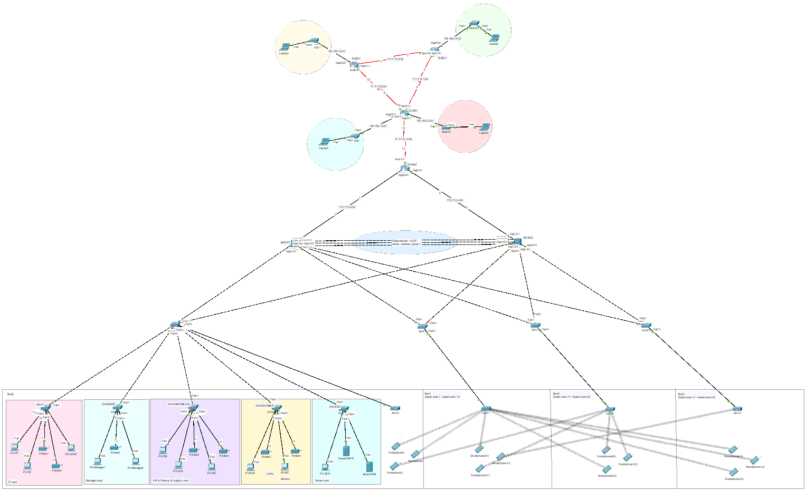

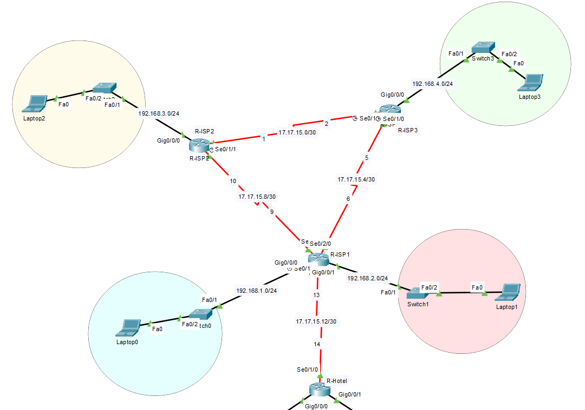

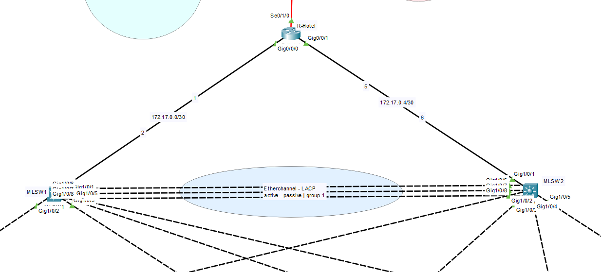

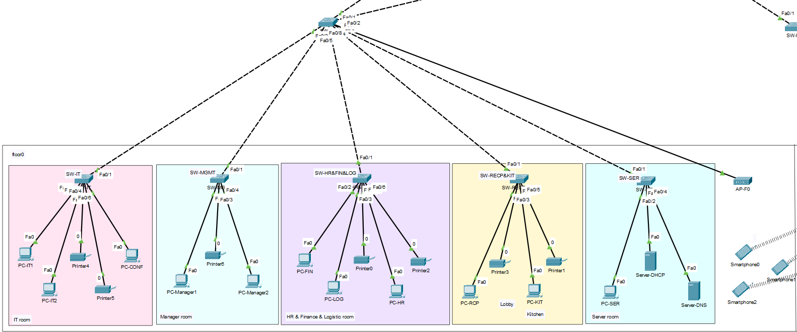

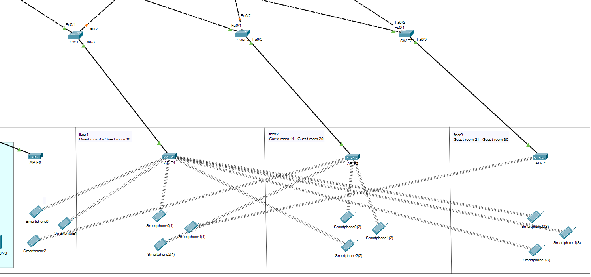

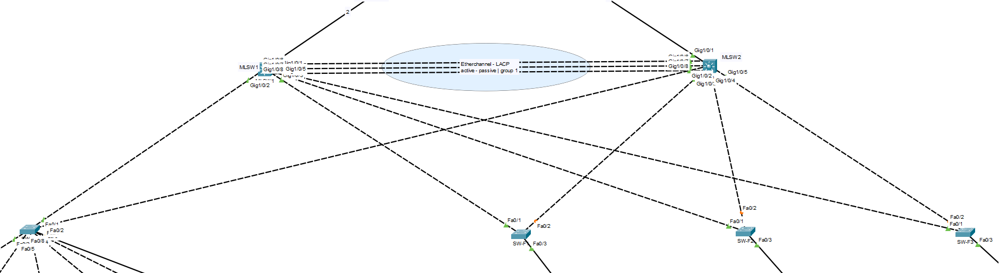

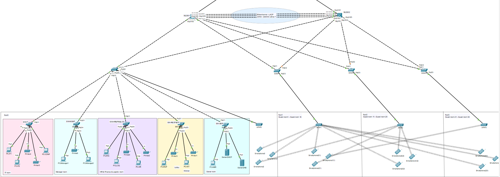

# Configure VTP

## SW-IT: VTP Server

`en`  
`configure terminal`

`vtp mode server`  
`vtp domain hotel-network`  
`vtp password 123`  
`vtp version 2`

`vlan 2`  
`name Management`  
`exit`

`vlan 3`  
`name Logistic`  
`exit`

`vlan 4`  
`name Reception`  
`exit`

`vlan 5`  
`name HumanResources`  
`exit`

`vlan 6`  
`name Finance`  
`exit`

`vlan 7`  
`name IT`  
`exit`

`vlan 8`  
`name Kitchen`  
`exit`

`vlan 9`  
`name Server`  
`exit`

`vlan 10`  
`name Configuration`  
`exit`

`vlan 11`  
`name WLAN`  
`exit`

`vlan 999`  
`name Blackhole`  
`exit`

`exit`  
`write memory`

## SW-F0, SW-F1, SW-F2, SW-F3, SW-MGMT, SW-HR\&FIN\&LOG,  SW-RECP\&KIT,  SW-SER: VTP Client

`en`  
`configure terminal`

`vtp mode client`  
`vtp domain hotel-network`  
`vtp password 123`  
`vtp version 2`  
`do wr`

## MLSW1, MLSW2

`en`  
`configure terminal`

`interface range gig1/0/2-8`  
`vtp mode client`  
`vtp domain hotel-network`  
`vtp password 123`  
`vtp version 2`  
`do wr`

# Configure Trunk Ports 

## SW-F0

`en`  
`configure terminal`

`interface range fa0/1-7`  
`switchport mode trunk`  
`exit`  
`do wr`

## SW-F1, SW-F2, SW-F3

`en`  
`configure terminal`

`interface range fa0/1-2`  
`switchport mode trunk`  
`exit`  
`do wr`

## SW-IT, SW-MGMT, SW-HR\&FIN\&LOG, SW-RECP\&KIT, SW-SER

`en`  
`configure terminal`

`interface fa0/1`  
`switchport mode trunk`  
`exit`  
`do wr`

## MLSW1, MLSW2

`en`  
`configure terminal`

`interface range gig1/0/2-8`  
`switchport mode trunk`  
`exit`  
`do wr`

# Configure VLAN

## SW-IT

`en`  
`configure terminal`

`int range fa0/2-5`  
`switchport mode access`  
`switchport access vlan 7`  
`exit`

`int fa0/6`  
`switchport mode access`  
`switchport access vlan 10`  
`exit`

`int range fa0/7-24`  
`switchport mode access`  
`switchport access vlan 999`  
`shutdown`  
`exit`

`int range gig0/1-2`  
`switchport mode access`  
`switchport access vlan 999`  
`shutdown`  
`exit`

`do wr`

## SW-MGMT

`en`  
`configure terminal`

`int range fa0/2-4`  
`switchport mode access`  
`switchport access vlan 2`  
`exit`

`int range fa0/5-24`  
`switchport mode access`  
`switchport access vlan 999`  
`shutdown`  
`exit`

`int range gig0/1-2`  
`switchport mode access`  
`switchport access vlan 999`  
`shutdown`  
`exit`

`do wr`

## SW-HR\&FIN\&LOG

`en`  
`configure terminal`

`int fa0/2`  
`switchport mode access`  
`switchport access vlan 6`  
`exit`

`int range fa0/3-4`  
`switchport mode access`  
`switchport access vlan 3`  
`exit`

`int range fa0/5-6`  
`switchport mode access`  
`switchport access vlan 5`  
`exit`

`int range fa0/7-24`  
`switchport mode access`  
`switchport access vlan 999`  
`shutdown`  
`exit`

`int range gig0/1-2`  
`switchport mode access`  
`switchport access vlan 999`  
`shutdown`  
`exit`

`do wr`

## SW-RECP\&KIT

`en`  
`configure terminal`

`int range fa0/2-3`  
`switchport mode access`  
`switchport access vlan 4`  
`exit`

`int range fa0/4-5`  
`switchport mode access`  
`switchport access vlan 8`  
`exit`

`int range fa0/6-24`  
`switchport mode access`  
`switchport access vlan 999`  
`shutdown`  
`exit`

`int range gig0/1-2`  
`switchport mode access`  
`switchport access vlan 999`  
`shutdown`  
`exit`

`do wr`

## SW-SER

`en`  
`configure terminal`

`int range fa0/2-4`  
`switchport mode access`  
`switchport access vlan 9`  
`exit`

`int range fa0/5-24`  
`switchport mode access`  
`switchport access vlan 999`  
`shutdown`  
`exit`

`int range gig0/1-2`  
`switchport mode access`  
`switchport access vlan 999`  
`shutdown`  
`exit`

`do wr`

## SW-F0

`en`  
`configure terminal`

`int range fa0/8`  
`switchport mode access`  
`switchport access vlan 11`  
`exit`

`int range fa0/9-24`  
`switchport mode access`  
`switchport access vlan 999`  
`shutdown`  
`exit`

`int range gig0/1-2`  
`switchport mode access`  
`switchport access vlan 999`  
`shutdown`  
`exit`

`do wr`

## SW-F1, SW-F2, SW-F3

`en`  
`configure terminal`

`int range fa0/3`  
`switchport mode access`  
`switchport access vlan 11`  
`exit`

`int range fa0/4-24`  
`switchport mode access`  
`switchport access vlan 999`  
`shutdown`  
`exit`

`int range gig0/1-2`  
`switchport mode access`  
`switchport access vlan 999`  
`shutdown`  
`exit`

`do wr`

# Configure Etherchannel

## MLSW1 

`en`  
`configure terminal`

`int range gig1/0/6-8`  
`channel-group 1 mode active`  
`exit`

`interface port-channel 1`  
`switchport mode trunk`  
`exit`

`do wr`

## MLSW2

`en`  
`configure terminal`

`int range gig1/0/6-8`  
`channel-group 1 mode passive`  
`exit`

`interface port-channel 1`  
`switchport mode trunk`  
`exit`

`do wr`

# Assign IP Addresses And Configure OSPF - Inside Network

## MLSW1

`en`  
`configure terminal`

`ip routing`

`int gig1/0/1`  
`no switchport`  
`ip add 172.17.0.2 255.255.255.252`  
`no shutdown`  
`ex`

`router ospf 1`  
`router-id 1.1.1.1`  
`network 172.17.1.0 0.0.0.7 area 0`  
`network 172.17.1.8 0.0.0.7 area 0`  
`network 172.17.1.16 0.0.0.7 area 0`  
`network 172.17.1.24 0.0.0.7 area 0`  
`network 172.17.1.32 0.0.0.7 area 0`  
`network 172.17.1.40 0.0.0.7 area 0`  
`network 172.17.1.48 0.0.0.7 area 0`  
`network 172.17.1.56 0.0.0.7 area 0`  
`network 172.17.2.0 0.0.0.15 area 0`  
`network 172.18.0.0 0.0.0.127 area 0`  
`network 172.17.0.0 0.0.0.3 area 0`  
`exit`

`do wr`

## MLSW2

`en`  
`configure terminal`

`ip routing`

`int gig1/0/1`  
`no switchport`  
`ip add 172.17.0.6 255.255.255.252`  
`no shutdown`  
`ex`

`router ospf 1`  
`router-id 1.1.1.2`  
`network 172.17.1.0 0.0.0.7 area 0`  
`network 172.17.1.8 0.0.0.7 area 0`  
`network 172.17.1.16 0.0.0.7 area 0`  
`network 172.17.1.24 0.0.0.7 area 0`  
`network 172.17.1.32 0.0.0.7 area 0`  
`network 172.17.1.40 0.0.0.7 area 0`  
`network 172.17.1.48 0.0.0.7 area 0`  
`network 172.17.1.56 0.0.0.7 area 0`  
`network 172.17.2.0 0.0.0.15 area 0`  
`network 172.18.0.0 0.0.0.127 area 0`  
`network 172.17.0.4 0.0.0.3 area 0`  
`exit`

`do wr`

## R-Hotel

`en`  
`configure terminal`

`interface gigabit0/0/0`  
`ip address 172.17.0.1 255.255.255.252`  
`no shutdown`  
`exit`

`interface gigabit0/0/1`  
`ip address 172.17.0.5 255.255.255.252`  
`no shutdown`  
`exit`

`router ospf 1`  
`router-id 1.1.1.3`  
`network 172.17.0.0 0.0.0.3 area 0`  
`network 172.17.0.4 0.0.0.3 area 0`  
`exit`

`do wr`

# Configure Static IP

## Server-DHCP

* IPv4: 172.17.1.58  
* Subnet Mask: 255.255.255.248  
* Default Gateway: 172.17.1.57  
* DNS Server: 172.17.1.59

## Server-DNS

* IPv4: 172.17.1.59  
* Subnet Mask: 255.255.255.248  
* Default Gateway: 172.17.1.57  
* DNS Server: 8.8.8.8

# Configure DHCP Server

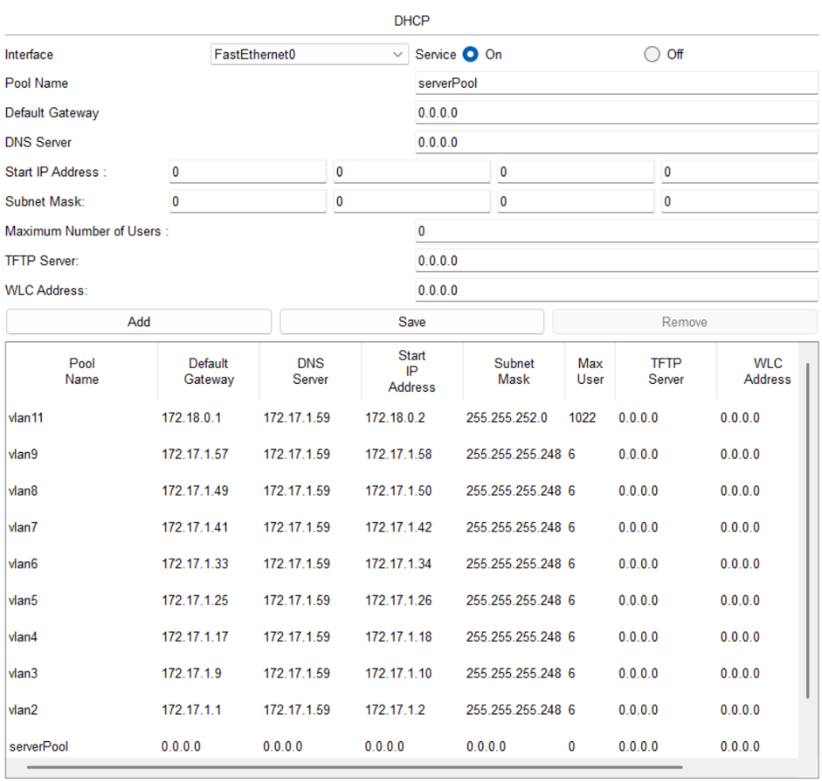

# Configure Inter-VLAN

## MLSW1 | MLSW2

`en`  
`configure terminal`

`int vlan 2`  
`no sh`  
`ip address 172.17.1.1 255.255.255.248`  
`ip helper-address 172.17.1.58`  
`exit`

`int vlan 3`  
`no sh`  
`ip address 172.17.1.9 255.255.255.248`  
`ip helper-address 172.17.1.58`  
`exit`

`int vlan 4`  
`no sh`  
`ip address 172.17.1.17 255.255.255.248`  
`ip helper-address 172.17.1.58`  
`exit`

`int vlan 5`  
`no sh`  
`ip address 172.17.1.25 255.255.255.248`  
`ip helper-address 172.17.1.58`  
`exit`

`int vlan 6`  
`no sh`  
`ip address 172.17.1.33 255.255.255.248`  
`ip helper-address 172.17.1.58`  
`exit`

`int vlan 7`  
`no sh`  
`ip address 172.17.1.41 255.255.255.248`  
`ip helper-address 172.17.1.58`  
`exit`

`int vlan 8`  
`no sh`  
`ip address 172.17.1.49 255.255.255.248`  
`ip helper-address 172.17.1.58`  
`exit`

`int vlan 9`  
`no sh`  
`ip address 172.17.1.57 255.255.255.248`  
`ip helper-address 172.17.1.58`  
`exit`

`int vlan 11`  
`no sh`  
`ip address 172.18.0.1 255.255.252.0`  
`ip helper-address 172.17.1.58`  
`exit`

`do wr`

# Assign IP Address 

To All PCs And Printers Inside Network

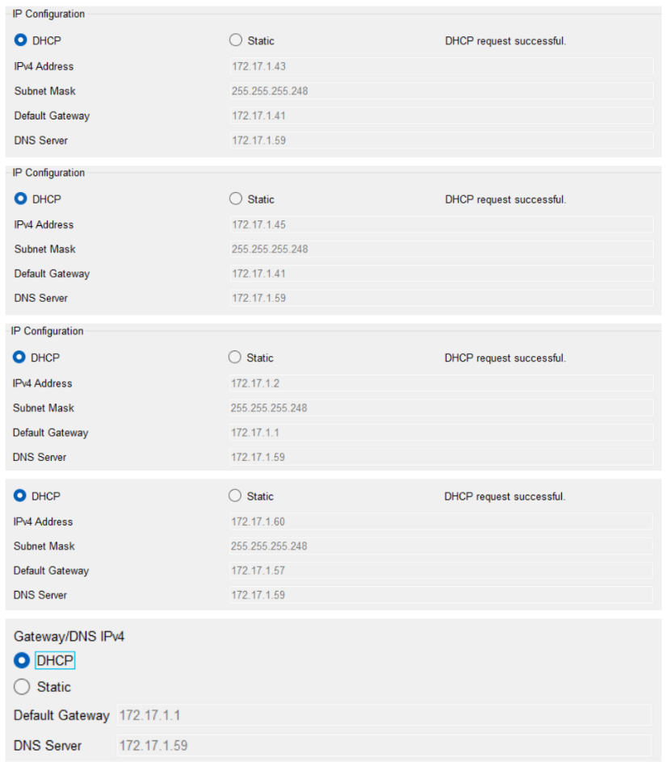

# Test

## Ping From PC-IT1 To PC-RCP

`C:\>ping 172.17.1.18`  
`Pinging 172.17.1.18 with 32 bytes of data:`  
`Request timed out.`  
`Reply from 172.17.1.18: bytes=32 time=2ms TTL=127`  
`Reply from 172.17.1.18: bytes=32 time<1ms TTL=127`  
`Reply from 172.17.1.18: bytes=32 time<1ms TTL=127`  
`Ping statistics for 172.17.1.18:`  
`Packets: Sent = 4, Received = 3, Lost = 1 (25% loss),`  
`Approximate round trip times in milli-seconds:`  
`Minimum = 0ms, Maximum = 2ms, Average = 0ms`

`C:\>tracert 172.17.1.18`  
`Tracing route to 172.17.1.18 over a maximum of 30 hops:`  
`1 0 ms 0 ms 0 ms 172.17.1.41`  
`2 0 ms 0 ms 0 ms 172.17.1.18`  
`Trace complete.`

# Configure Access Points

## AP-F0, AP-F1, AP-F2, AP-F3

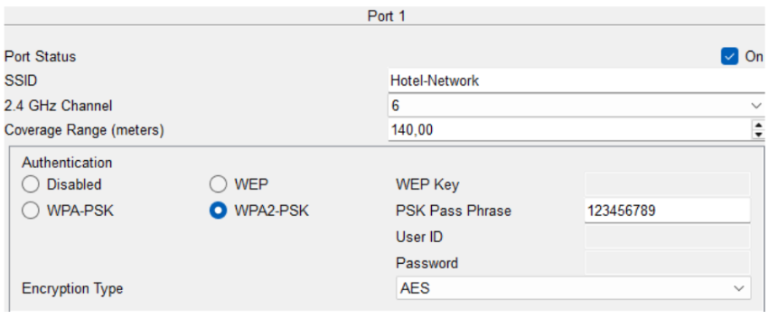

# Connect Each Smartphone To AP

## Smartphone 

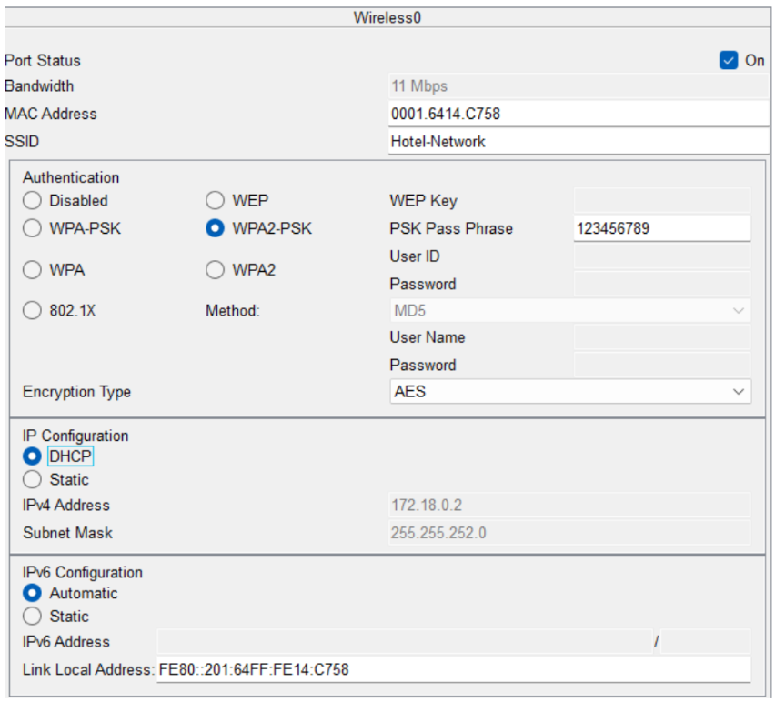

# Assign IP Addresses And Configure OSPF - Outside Network

## R-ISP1

`en`  
`configure terminal`

`interface serial0/1/0`  
`ip address 17.17.15.13 255.255.255.252`  
`no shutdown`  
`exit`

`interface serial0/1/1`  
`ip address 17.17.15.6 255.255.255.252`  
`no shutdown`  
`exit`

`interface serial0/2/0`  
`ip address 17.17.15.9 255.255.255.252`  
`no shutdown`  
`exit`

`interface gig0/0/0`  
`ip address 192.168.1.1 255.255.255.0`  
`no shutdown`  
`exit`

`interface gig0/0/1`  
`ip address 192.168.2.1 255.255.255.0`  
`no shutdown`  
`exit`

`router ospf 2`  
`router-id 1.1.1.1`  
`network 17.17.15.12 0.0.0.3 area 1`  
`network 17.17.15.8 0.0.0.3 area 1`  
`network 17.17.15.4 0.0.0.3 area 1`  
`network 192.168.1.0 0.0.0.255 area 1`  
`network 192.168.2.0 0.0.0.255 area 1`  
`exit`

`do wr`

## R-ISP2

`en`  
`configure terminal`

`interface serial0/1/0`  
`ip address 17.17.15.10 255.255.255.252`  
`no shutdown`  
`exit`

`interface serial0/1/1`  
`ip address 17.17.15.1 255.255.255.252`  
`no shutdown`  
`exit`

`interface gig0/0/0`  
`ip address 192.168.3.1 255.255.255.0`  
`no shutdown`  
`exit`

`router ospf 2`  
`router-id 1.1.2.1`  
`network 17.17.15.0 0.0.0.3 area 1`  
`network 17.17.15.8 0.0.0.3 area 1`  
`network 192.168.3.0 0.0.0.255 area 1`  
`exit`

`do wr`

## R-ISP3

`en`  
`configure terminal`

`interface serial0/1/0`  
`ip address 17.17.15.2 255.255.255.252`  
`no shutdown`  
`exit`

`interface serial0/1/1`  
`ip address 17.17.15.5 255.255.255.252`  
`no shutdown`  
`exit`

`interface gig0/0/0`  
`ip address 192.168.4.1 255.255.255.0`  
`no shutdown`  
`exit`

`router ospf 2`  
`router-id 1.1.3.1`  
`network 17.17.15.0 0.0.0.3 area 1`  
`network 17.17.15.4 0.0.0.3 area 1`  
`network 192.168.4.0 0.0.0.255 area 1`  
`exit`

`do wr`

## R-Hotel

`en`  
`configure terminal`

`interface serial0/1/0`  
`ip address 17.17.15.14 255.255.255.252`  
`no shutdown`  
`exit`

`router ospf 2`  
`router-id 1.1.1.2`  
`network 17.17.15.12 0.0.0.3 area 1`  
`exit`

`router ospf 2`  
`redistribute ospf 1 subnets`  
`exit`

`router ospf 1`  
`redistribute ospf 2 subnets`  
`exit`

`do wr`

## Assign Static IP

| Device  | IP          | Subnet Mask   | Gateway     |
|:--------|:------------|:--------------|:------------|
| Laptop0 | 192.168.1.2 | 255.255.255.0 | 192.168.1.1 |
| Laptop1 | 192.168.2.2 | 255.255.255.0 | 192.168.2.1 |
| Laptop2 | 192.168.3.2 | 255.255.255.0 | 192.168.3.1 |
| Laptop3 | 192.168.4.2 | 255.255.255.0 | 192.168.4.1 |

## Test On PC-IT1

`C:\>tracert 192.168.4.2`  
`Tracing route to 192.168.4.2 over a maximum of 30 hops:`  
`1 0 ms 0 ms 0 ms 172.17.1.1`  
`2 0 ms 0 ms 0 ms 172.17.0.1`  
`3 0 ms 17 ms 0 ms 17.17.15.13`  
`4 13 ms 16 ms 1 ms 17.17.15.5`  
`5 1 ms 1 ms 2 ms 192.168.4.2`  
Trace complete.

# Configure NAT Overload

## R-Hotel

`enable`  
`configure terminal`

`ip access-list standard NAT_OVERLOAD_ACL`  
`permit 172.17.1.0 0.0.0.7`   
`permit 172.17.1.8 0.0.0.7`   
`permit 172.17.1.16 0.0.0.7`   
`permit 172.17.1.24 0.0.0.7`   
`permit 172.17.1.32 0.0.0.7`   
`permit 172.17.1.40 0.0.0.7`   
`permit 172.17.1.48 0.0.0.7`   
`permit 172.17.1.56 0.0.0.7`   
`permit 172.18.0.0 0.0.3.255`   
`deny any`  
`exit`

`ip nat inside source list NAT_OVERLOAD_ACL interface serial0/1/0 overload`

`interface gig0/0/0`  
`ip nat inside`  
`exit`

`interface gig0/0/1`  
`ip nat inside`  
`exit`

`interface serial0/1/0`  
`ip nat outside`  
`exit` 

`do wr`

# Configure Default Static Route

## MLSW1 | MLSW2

`enable`  
`configure terminal`

`ip route 0.0.0.0 0.0.0.0 gig1/0/1`  
`do wr`

## R-Hotel

`enable`  
`configure terminal`

`ip route 0.0.0.0 0.0.0.0 serial 0/1/0`  
`do wr`

# Test

## PC-RCP

`C:\>ping 192.168.4.2`  
`Pinging 192.168.4.2 with 32 bytes of data:`  
`Reply from 192.168.4.2: bytes=32 time=2ms TTL=124`  
`Reply from 192.168.4.2: bytes=32 time=41ms TTL=124`  
`Reply from 192.168.4.2: bytes=32 time=25ms TTL=124`  
`Reply from 192.168.4.2: bytes=32 time=3ms TTL=124`  
`Ping statistics for 192.168.4.2:`  
`Packets: Sent = 4, Received = 4, Lost = 0 (0% loss),`  
`Approximate round trip times in milli-seconds:`  
`Minimum = 2ms, Maximum = 41ms, Average = 17ms`

## R-Hotel

`Router#show ip nat translations`  
`Pro Inside global   Inside local   Outside local  Outside global`  
`icmp 17.17.15.14:1  172.17.1.34:1  192.168.4.2:1  192.168.4.2:1`  
`icmp 17.17.15.14:2  172.17.1.34:2  192.168.4.2:2  192.168.4.2:2`  
`icmp 17.17.15.14:3  172.17.1.34:3  192.168.4.2:3  192.168.4.2:3`  
`icmp 17.17.15.14:45 172.17.1.6:45  192.168.4.1:45 192.168.4.1:45`  
`icmp 17.17.15.14:46 172.17.1.6:46  192.168.4.1:46 192.168.4.1:46`  
`icmp 17.17.15.14:47 172.17.1.6:47  192.168.3.1:47 192.168.3.1:47`  
`icmp 17.17.15.14:48 172.17.1.6:48  192.168.2.1:48 192.168.2.1:48`  
`icmp 17.17.15.14:49 172.17.1.6:49  192.168.1.1:49 192.168.1.1:49`  
`icmp 17.17.15.14:4  172.17.1.34:4  192.168.4.2:4  192.168.4.2:4`  
`icmp 17.17.15.14:50 172.17.1.6:50  192.168.1.1:50 192.168.1.1:50`  
`icmp 17.17.15.14:51 172.17.1.6:51  17.17.15.1:51  17.17.15.1:51`  
`icmp 17.17.15.14:52 172.17.1.6:52  17.17.15.1:52  17.17.15.1:52`  
`icmp 17.17.15.14:5  172.17.1.34:5  192.168.4.1:5  192.168.4.1:5`  
`icmp 17.17.15.14:6  172.17.1.34:6  192.168.4.1:6  192.168.4.1:6`  
`icmp 17.17.15.14:7  172.17.1.34:7  192.168.4.1:7  192.168.4.1:7`  
`icmp 17.17.15.14:8  172.17.1.34:8  192.168.4.1:8  192.168.4.1:8`  
`Router#show ip ospf database` 

# Configure SSH And Basic Settings For Company Network Devices

## SW-IT

`enable`  
`configure terminal`

`line console 0`  
`password 123`  
`login`  
`exec-timeout 10 0`  
`exit`

`enable secret 123`  
`banner motd #Password required!#`  
`no ip domain-lookup`  
`service password-encryption`

`hostname SW-IT`  
`ip domain-name hotel.management.project`  
`username adminName privilege 15 secret mypassword123`  
`crypto key generate rsa`  
`! How many bits in the modulus [512]: 1024 !`  
`ip ssh version 2`

`access-list 2 permit 172.17.2.1 0.0.0.0`  
`access-list 2 deny any`

`line vty 0 15`  
`transport input ssh`  
`login local`  
`exec-timeout 10 0`  
`access-class 2 in`  
`exit`

`interface vlan 10`  
`ip address 172.17.2.2 255.255.255.240`  
`no shutdown`  
`exit`

`do wr`

## SW-MGT

`enable`  
`configure terminal`

`line console 0`  
`password 123`  
`login`  
`exec-timeout 10 0`  
`exit`

`enable secret 123`  
`banner motd #Password required!#`  
`no ip domain-lookup`  
`service password-encryption`

`hostname SW-MGMT`  
`ip domain-name hotel.management.project`  
`username adminName privilege 15 secret mypassword123`  
`crypto key generate rsa`  
`! How many bits in the modulus [512]: 1024 !`  
`ip ssh version 2`

`access-list 2 permit 172.17.2.1 0.0.0.0`  
`access-list 2 deny any`

`line vty 0 15`  
`transport input ssh`  
`login local`  
`exec-timeout 10 0`  
`access-class 2 in`  
`exit`

`interface vlan 10`  
`ip address 172.17.2.3 255.255.255.240`  
`no shutdown`  
`exit`

`do wr`

## SW-HR\&FIN\&LOG

`enable`  
`configure terminal`

`line console 0`  
`password 123`  
`login`  
`exec-timeout 10 0`  
`exit`

`enable secret 123`  
`banner motd #Password required!#`  
`no ip domain-lookup`  
`service password-encryption`

`hostname SW-HR&FIN&LOG`  
`ip domain-name hotel.management.project`  
`username adminName privilege 15 secret mypassword123`  
`crypto key generate rsa`  
`! How many bits in the modulus [512]: 1024 !`  
`ip ssh version 2`

`access-list 2 permit 172.17.2.1 0.0.0.0`  
`access-list 2 deny any`

`line vty 0 15`  
`transport input ssh`  
`login local`  
`exec-timeout 10 0`  
`access-class 2 in`  
`exit`

`interface vlan 10`  
`ip address 172.17.2.4 255.255.255.240`  
`no shutdown`  
`exit`

`do wr`

## SW-RECP\&KIT

`enable`  
`configure terminal`

`line console 0`  
`password 123`  
`login`  
`exec-timeout 10 0`  
`exit`

`enable secret 123`  
`banner motd #Password required!#`  
`no ip domain-lookup`  
`service password-encryption`

`hostname SW-RECP&KIT`  
`ip domain-name hotel.management.project`  
`username adminName privilege 15 secret mypassword123`  
`crypto key generate rsa`  
`! How many bits in the modulus [512]: 1024 !`  
`ip ssh version 2`

`access-list 2 permit 172.17.2.1 0.0.0.0`  
`access-list 2 deny any`

`line vty 0 15`  
`transport input ssh`  
`login local`  
`exec-timeout 10 0`  
`access-class 2 in`  
`exit`

`interface vlan 10`  
`ip address 172.17.2.5 255.255.255.240`  
`no shutdown`  
`exit`

`do wr`

## SW-SER

`enable`  
`configure terminal`

`line console 0`  
`password 123`  
`login`  
`exec-timeout 10 0`  
`exit`

`enable secret 123`  
`banner motd #Password required!#`  
`no ip domain-lookup`  
`service password-encryption`

`hostname SW-SER`  
`ip domain-name hotel.management.project`  
`username adminName privilege 15 secret mypassword123`  
`crypto key generate rsa`  
`! How many bits in the modulus [512]: 1024 !`  
`ip ssh version 2`

`access-list 2 permit 172.17.2.1 0.0.0.0`  
`access-list 2 deny any`

`line vty 0 15`  
`transport input ssh`  
`login local`  
`exec-timeout 10 0`  
`access-class 2 in`  
`exit`

`interface vlan 10`  
`ip address 172.17.2.6 255.255.255.240`  
`no shutdown`  
`exit`

`do wr`

## SW-F0

`enable`  
`configure terminal`

`line console 0`  
`password 123`  
`login`  
`exec-timeout 10 0`  
`exit`

`enable secret 123`  
`banner motd #Password required!#`  
`no ip domain-lookup`  
`service password-encryption`

`hostname SW-F0`  
`ip domain-name hotel.management.project`  
`username adminName privilege 15 secret mypassword123`  
`crypto key generate rsa`  
`! How many bits in the modulus [512]: 1024 !`  
`ip ssh version 2`

`access-list 2 permit 172.17.2.1 0.0.0.0`  
`access-list 2 deny any`

`line vty 0 15`  
`transport input ssh`  
`login local`  
`exec-timeout 10 0`  
`access-class 2 in`  
`exit`

`interface vlan 10`  
`ip address 172.17.2.7 255.255.255.240`  
`no shutdown`  
`exit`

`do wr`

## SW-F1

`enable`  
`configure terminal`

`line console 0`  
`password 123`  
`login`  
`exec-timeout 10 0`  
`exit`

`enable secret 123`  
`banner motd #Password required!#`  
`no ip domain-lookup`  
`service password-encryption`

`hostname SW-F1`  
`ip domain-name hotel.management.project`  
`username adminName privilege 15 secret mypassword123`  
`crypto key generate rsa`  
`! How many bits in the modulus [512]: 1024 !`  
`ip ssh version 2`

`access-list 2 permit 172.17.2.1 0.0.0.0`  
`access-list 2 deny any`

`line vty 0 15`  
`transport input ssh`  
`login local`  
`exec-timeout 10 0`  
`access-class 2 in`  
`exit`

`interface vlan 10`  
`ip address 172.17.2.8 255.255.255.240`  
`no shutdown`  
`exit`

`do wr`

## SW-F2

`enable`  
`configure terminal`

`line console 0`  
`password 123`  
`login`  
`exec-timeout 10 0`  
`exit`

`enable secret 123`  
`banner motd #Password required!#`  
`no ip domain-lookup`  
`service password-encryption`

`hostname SW-F2`  
`ip domain-name hotel.management.project`  
`username adminName privilege 15 secret mypassword123`  
`crypto key generate rsa`  
`! How many bits in the modulus [512]: 1024 !`  
`ip ssh version 2`

`access-list 2 permit 172.17.2.1 0.0.0.0`  
`access-list 2 deny any`

`line vty 0 15`  
`transport input ssh`  
`login local`  
`exec-timeout 10 0`  
`access-class 2 in`  
`exit`

`interface vlan 10`  
`ip address 172.17.2.9 255.255.255.240`  
`no shutdown`  
`exit`

`do wr`

## SW-F3

`enable`  
`configure terminal`

`line console 0`  
`password 123`  
`login`  
`exec-timeout 10 0`  
`exit`

`enable secret 123`  
`banner motd #Password required!#`  
`no ip domain-lookup`  
`service password-encryption`

`hostname SW-F3`  
`ip domain-name hotel.management.project`  
`username adminName privilege 15 secret mypassword123`  
`crypto key generate rsa`  
`! How many bits in the modulus [512]: 1024 !`  
`ip ssh version 2`

`access-list 2 permit 172.17.2.1 0.0.0.0`  
`access-list 2 deny any`

`line vty 0 15`  
`transport input ssh`  
`login local`  
`exec-timeout 10 0`  
`access-class 2 in`  
`exit`

`interface vlan 10`  
`ip address 172.17.2.10 255.255.255.240`  
`no shutdown`  
`exit`

`do wr`

## MLSW1

`enable`  
`configure terminal`

`line console 0`  
`password 123`  
`login`  
`exec-timeout 10 0`  
`exit`

`enable secret 123`  
`banner motd #Password required!#`  
`no ip domain-lookup`  
`service password-encryption`

`hostname MLSW1`  
`ip domain-name hotel.management.project`  
`username adminName privilege 15 secret mypassword123`  
`crypto key generate rsa`  
`! How many bits in the modulus [512]: 1024 !`  
`ip ssh version 2`

`access-list 2 permit 172.17.2.1 0.0.0.0`  
`access-list 2 deny any`

`line vty 0 15`  
`transport input ssh`  
`login local`  
`exec-timeout 10 0`  
`access-class 2 in`  
`exit`

`interface vlan 10`  
`ip address 172.17.2.11 255.255.255.240`  
`no shutdown`  
`exit`

`do wr`

## MLSW2

`enable`  
`configure terminal`

`line console 0`  
`password 123`  
`login`  
`exec-timeout 10 0`  
`exit`

`enable secret 123`  
`banner motd #Password required!#`  
`no ip domain-lookup`  
`service password-encryption`

`hostname MLSW2`  
`ip domain-name hotel.management.project`  
`username adminName privilege 15 secret mypassword123`  
`crypto key generate rsa`  
`! How many bits in the modulus [512]: 1024 !`  
`ip ssh version 2`

`access-list 2 permit 172.17.2.1 0.0.0.0`  
`access-list 2 deny any`

`line vty 0 15`  
`transport input ssh`  
`login local`  
`exec-timeout 10 0`  
`access-class 2 in`  
`exit`

`interface vlan 10`  
`ip address 172.17.2.12 255.255.255.240`  
`no shutdown`  
`exit`

`do wr`

## R-Hotel

`enable`  
`configure terminal`

`line console 0`  
`password 123`  
`login`  
`exec-timeout 10 0`  
`exit`

`enable secret 123`  
`banner motd #Password required!#`  
`no ip domain-lookup`  
`service password-encryption`

`hostname R-Hotel`  
`ip domain-name hotel.management.project`  
`username adminName privilege 15 secret mypassword123`  
`crypto key generate rsa`  
`! How many bits in the modulus [512]: 1024 !`  
`ip ssh version 2`

`access-list 2 permit 172.17.2.1 0.0.0.0`  
`access-list 2 deny any`

`line vty 0 15`  
`transport input ssh`  
`login local`  
`exec-timeout 10 0`  
`access-class 2 in`  
`exit`

`do wr`

# Test

## Assign Static IP Address To PC-CONF

* IPv4: 172.17.2.1  
* Subnet Mask: 255.255.255.240  
* Default Gateway: 172.17.2.11

## On PC-CONF: Open CMD

`C:\>ssh -l adminName 172.17.2.2`  
`Password: -> mypassword123`  
`Password required!`  
`SW-I#ex`  
`[Connection to 172.17.2.2 closed by foreign host]`  
`C:\>`

`C:\>ssh -l adminName 172.17.2.12`  
`Password: -> mypassword123`  
`Password required!`  
`MLSW2#ex`  
`[Connection to 172.17.2.12 closed by foreign host]`  
`C:\>`

`C:\>ssh -l adminName 172.17.0.1`  
`Password:`  
`Password required!`  
`R-Hotel#en`  
`R-Hotel#show ip ospf database`

## On PC-IT2: Open CMD

`C:\>ssh -l adminName 172.17.2.12`  
`% Connection refused by remote host`  
`C:\>`

# STP Configuration

## SW-IT, SW-MGMT, SW-HR\&FIN\&LOG, SW-RECP\&KIT, SW-SER

### `en`

### `configure terminal`

`int range fa0/2-24, gig0/1-2`  
`spanning-tree portfast`  
`spanning-tree bpduguard enable`  
`exit`

`spanning-tree portfast default`  
`spanning-tree portfast bpduguard default`

`do wr`

## SW-F1, SW-F2, SW-F3

### `en`

### `configure terminal`

`int range fa0/3-24, gig0/1-2`  
`spanning-tree portfast`  
`spanning-tree bpduguard enable`  
`exit`

`spanning-tree portfast default`  
`spanning-tree portfast bpduguard default`

`do wr`

## SW-F0

### `en`

### `configure terminal`

`int range fa0/8-24 , gi0/1-2`  
`spanning-tree portfast`  
`spanning-tree bpduguard enable`  
`exit`

`do wr`

## MLSW1 \- MLSW2

### `en`

### `configure terminal`

`spanning-tree mode rapid-pvst`  
`spanning-tree vlan 2-11,999 root primary`  
`exit`  
`wr`

