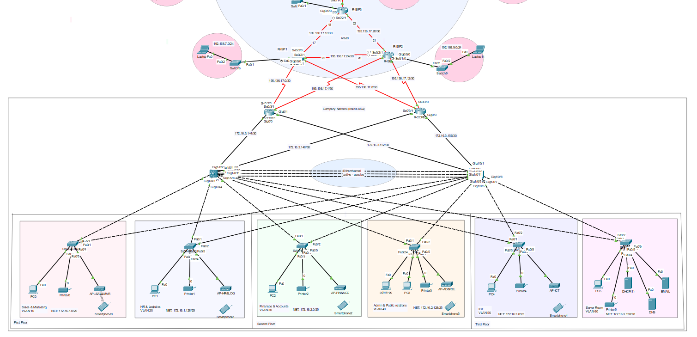

| Department               | VLAN ID |
|:-------------------------|:--------|
| Sales & Marketing        | 10      |
| HR & Logistics           | 20      |
| Finance & Accounts       | 30      |
| Admin & Public Relations | 40      |
| ICT                      | 50      |
| Server Room              | 60      |
| Management               | 70      |

# Configure Trunk Ports And VLANs

### SW-SAL\&MAR

`en`  
`configure terminal`

`interface range fa0/1-2`  
`switchport mode trunk`  
`exit`

`vlan 10`  
`name Sales&Marketing`  
`exit`

`vlan 70`  
`name Management`  
`exit`

`vlan 999`  
`name Blackhole`  
`exit`

`int range fa0/3-24`  
`switchport mode access`  
`switchport access vlan 10`  
`exit`

`int range gig0/1-2`  
`switchport mode access`  
`switchport access vlan 999`  
`shutdown`  
`exit`

`do wr`

### SW-HR\&LOG

`en`  
`configure terminal`

`interface range fa0/1-2`  
`switchport mode trunk`  
`exit`

`vlan 20`  
`name HR&Logistics`  
`exit`

`vlan 999`  
`name Blackhole`  
`exit`

`int range fa0/3-24`  
`switchport mode access`  
`switchport access vlan 20`  
`exit`

`int range gig0/1-2`  
`switchport mode access`  
`switchport access vlan 999`  
`shutdown`  
`exit`

`do wr`

### SW-FIN\&ACC

`en`  
`configure terminal`

`interface range fa0/1-2`  
`switchport mode trunk`  
`exit`

`vlan 30`  
`name Finance&Accunts`  
`exit`

`vlan 999`  
`name Blackhole`  
`exit`

`int range fa0/3-24`  
`switchport mode access`  
`switchport access vlan 30`  
`exit`

`int range gig0/1-2`  
`switchport mode access`  
`switchport access vlan 999`  
`shutdown`  
`exit`

`do wr`

### SW-AD\&REL

`en`  
`configure terminal`

`interface range fa0/1-2`  
`switchport mode trunk`  
`exit`

`vlan 40`  
`name Admin&PublicRelations`  
`exit`

`vlan 70`  
`name Management`  
`exit`

`vlan 999`  
`name Blackhole`  
`exit`

`int range fa0/3-23`  
`switchport mode access`  
`switchport access vlan 40`  
`exit`

`int fa0/24`  
`switchport mode access`  
`switchport access vlan 70`  
`exit`

`int range gig0/1-2`  
`switchport mode access`  
`switchport access vlan 999`  
`shutdown`  
`exit`

`do wr`

### SW-ICT

`en`  
`configure terminal`

`interface range fa0/1-2`  
`switchport mode trunk`  
`exit`

`vlan 50`  
`name ICT`  
`exit`

`vlan 999`  
`name Blackhole`  
`exit`

`int range fa0/3-24`  
`switchport mode access`  
`switchport access vlan 50`  
`exit`

`int range gig0/1-2`  
`switchport mode access`  
`switchport access vlan 999`  
`shutdown`  
`exit`

`do wr`

### SW-SER

`en`  
`configure terminal`

`interface range fa0/1-2`  
`switchport mode trunk`  
`exit`

`vlan 60`  
`name Server`  
`exit`

`vlan 999`  
`name Blackhole`  
`exit`

`int range fa0/3-24`  
`switchport mode access`  
`switchport access vlan 60`  
`exit`

`int range gig0/1-2`  
`switchport mode access`  
`switchport access vlan 999`  
`shutdown`  
`exit`

`do wr`

### MLSW1  AND  MLSW2

`en`  
`configure terminal`

`interface range gig1/0/3-8`  
`switchport mode trunk`

`vlan 10`  
`name Sales&Marketing`  
`vlan 20`  
`name HR&Logistics`  
`vlan 30`  
`name Finance&Accunts`  
`vlan 40`  
`name Admin&PublicRelations`  
`vlan 50`  
`name ICT`  
`vlan 60`  
`name Server`  
`vlan 70`  
`name Management`  
`ex`

`do wr`

# Assign IP Addresses, Configure OSPF

## MLSW1

`en`  
`configure terminal`

`ip routing`

`int gig1/0/1`  
`no switchport`  
`ip add 172.16.3.145 255.255.255.252`  
`no shutdown`  
`ex`

`int gig1/0/2`  
`no switchport`  
`ip add 172.16.3.149 255.255.255.252`  
`no shutdown`  
`ex`

`router ospf 1`  
`router-id 1.1.1.1`  
`network 172.16.1.0 0.0.0.127 area 0`  
`network 172.16.1.128 0.0.0.127 area 0`  
`network 172.16.2.0 0.0.0.127 area 0`  
`network 172.16.2.128 0.0.0.127 area 0`  
`network 172.16.3.0 0.0.0.127 area 0`  
`network 172.16.3.128 0.0.0.15 area 0`  
`network 172.16.3.148 0.0.0.127 area 0`  
`network 172.16.3.144 0.0.0.127 area 0`  
`network 200.0.0.0 0.0.0.15 area 0`  
`exit`

`do wr`

## MLSW2

`en`  
`configure terminal`

`ip routing`

`int gig1/0/1`  
`no switchport`  
`ip add 172.16.3.157 255.255.255.252`  
`no shutdown`  
`ex`

`int gig1/0/2`  
`no switchport`  
`ip add 172.16.3.153 255.255.255.252`  
`no shutdown`  
`ex`

`router ospf 1`  
`router-id 1.1.1.2`  
`network 172.16.1.0 0.0.0.127 area 0`  
`network 172.16.1.128 0.0.0.127 area 0`  
`network 172.16.2.0 0.0.0.127 area 0`  
`network 172.16.2.128 0.0.0.127 area 0`  
`network 172.16.3.0 0.0.0.127 area 0`  
`network 172.16.3.128 0.0.0.15 area 0`  
`network 172.16.3.152 0.0.0.127 area 0`  
`network 172.16.3.156 0.0.0.127 area 0`  
`network 200.0.0.0 0.0.0.15 area 0`  
`exit`

`do wr`

## R-Core1

`en`  
`configure terminal`

`interface gigabit0/0`  
`ip address 172.16.3.146 255.255.255.252`  
`no shutdown`  
`exit`

`interface gigabit0/1`  
`ip address 172.16.3.154 255.255.255.252`  
`no shutdown`  
`exit`

`interface serial0/3/0`  
`ip address 195.136.17.1 255.255.255.252`  
`no shutdown`  
`exit`

`interface serial0/3/1`  
`ip address 195.136.17.5 255.255.255.252`  
`no shutdown`  
`exit`

`router ospf 1`  
`router-id 1.1.1.3`  
`network 172.16.3.144 0.0.0.3 area 0`  
`network 172.16.3.152 0.0.0.3 area 0`  
`network 195.136.17.0 0.0.0.3 area 0`  
`network 195.136.17.4 0.0.0.3 area 0`  
`exit`

`do wr`

## R-Core2

`en`  
`configure terminal`

`interface gigabit0/0`  
`ip address 172.16.3.158 255.255.255.252`  
`no shutdown`  
`exit`

`interface gigabit0/1`  
`ip address 172.16.3.150 255.255.255.252`  
`no shutdown`  
`exit`

`interface serial0/3/1`  
`ip address 195.136.17.9 255.255.255.252`  
`no shutdown`  
`exit`

`interface serial0/3/0`  
`ip address 195.136.17.13 255.255.255.252`  
`no shutdown`  
`exit`

`router ospf 1`  
`router-id 1.1.1.4`  
`network 172.16.3.156 0.0.0.3 area 0`  
`network 172.16.3.148 0.0.0.3 area 0`  
`network 195.136.17.12 0.0.0.3 area 0`  
`network 195.136.17.8 0.0.0.3 area 0`  
`exit`

`do wr`

# Configure DHCP Server

#### Test DHCP On PC0, PC1, PC2, PC3, PC4 And Printers

# Configure Inter-VLAN

## MLSW1 | MLSW2

`en`  
`configure terminal`

`int vlan 10`  
`no sh`  
`ip address 172.16.1.1 255.255.255.128`  
`ip helper-address 172.16.3.130`  
`exit`

`int vlan 20`  
`no sh`  
`ip address 172.16.1.129 255.255.255.128`  
`ip helper-address 172.16.3.130`  
`exit`

`int vlan 30`  
`no sh`  
`ip address 172.16.2.1 255.255.255.128`  
`ip helper-address 172.16.3.130`  
`exit`

`int vlan 40`  
`no sh`  
`ip address 172.16.2.129 255.255.255.128`  
`ip helper-address 172.16.3.130`  
`exit`

`int vlan 50`  
`no sh`  
`ip address 172.16.3.1 255.255.255.128`  
`ip helper-address 172.16.3.130`  
`exit`

`int vlan 60`  
`no sh`  
`ip address 172.16.3.129 255.255.255.240`  
`ip helper-address 172.16.3.130`  
`exit`

`do wr`

# Configure Access Points

# Test AP On Smartphone0

# Configure NAT Overload(PAT)

## R-Core1 | R-Core2

`enable`  
`configure terminal`

`ip access-list standard NAT_OVERLOAD_ACL`  
`permit 172.16.1.0 0.0.0.127`  
`permit 172.16.1.128 0.0.0.127`  
`permit 172.16.2.0 0.0.0.127`  
`permit 172.16.2.128 0.0.0.127`  
`permit 172.16.3.0 0.0.0.127`  
`permit 172.16.3.128 0.0.0.15`  
`deny any`  
`exit`

`ip nat inside source list NAT_OVERLOAD_ACL interface serial0/3/0 overload`

`ip nat inside source list NAT_OVERLOAD_ACL interface serial0/3/1 overload`

`interface gig0/0`  
`ip nat inside`  
`exit`

`interface gig0/1`  
`ip nat inside`  
`exit`

`interface serial0/3/0`  
`ip nat outside`  
`exit` 

`interface serial0/3/1`  
`ip nat outside`  
`exit` 

`do wr`

# Configure Default Static Route

## MLSW1 | MLSW2

`enable`  
`configure terminal`

`ip route 0.0.0.0 0.0.0.0 gig1/0/1`  
`ip route 0.0.0.0 0.0.0.0 gig1/0/2 70`  
`do wr`

## R-Core1 | R-Core2

`enable`  
`configure terminal`

`ip route 0.0.0.0 0.0.0.0 serial 0/3/1`  
`ip route 0.0.0.0 0.0.0.0 serial 0/3/0 70`  
`do wr`

# Configure Etherchannel

## MLSW1 

`en`  
`configure terminal`

`int range gig1/0/9-11`  
`channel-group 1 mode active`  
`exit`

`interface port-channel 1`  
`switchport mode trunk`  
`exit`

`do wr`

## MLSW2

`en`  
`configure terminal`

`int range gig1/0/9-11`  
`channel-group 1 mode passive`  
`exit`

`interface port-channel 1`  
`switchport mode trunk`  
`exit`

`do wr`

# Configure SSH And Basic Settings For Company Network Devices

## SW-SAL\&MAR

`enable`  
`configure terminal`

`line console 0`  
`password 123`  
`login`  
`exec-timeout 10 0`  
`exit`

`enable secret 123`  
`banner motd #Password required!#`  
`no ip domain-lookup`  
`service password-encryption`

`hostname SW-SAL&MAR`  
`ip domain-name hotel.management.project`  
`username adminName privilege 15 secret mypassword123`  
`crypto key generate rsa`  
`! How many bits in the modulus [512]: 1024 !`  
`ip ssh version 2`

`access-list 2 permit 200.0.0.1 0.0.0.0`  
`access-list 2 deny any`

`line vty 0 15`  
`transport input ssh`  
`login local`  
`exec-timeout 10 0`  
`access-class 2 in`  
`exit`

`interface vlan 70`  
`ip address 200.0.0.2 255.255.255.240`  
`no shutdown`  
`exit`

`do wr`

## SW-HR\&LOG

`enable`  
`configure terminal`

`line console 0`  
`password 123`  
`login`  
`exec-timeout 10 0`  
`exit`

`enable secret 123`  
`banner motd #Password required!#`  
`no ip domain-lookup`  
`service password-encryption`

`hostname SW-HR&LOG`  
`ip domain-name hotel.management.project`  
`username adminName privilege 15 secret mypassword123`  
`crypto key generate rsa`  
`! How many bits in the modulus [512]: 1024 !`  
`ip ssh version 2`

`access-list 2 permit 200.0.0.1 0.0.0.0`  
`access-list 2 deny any`

`line vty 0 15`  
`transport input ssh`  
`login local`  
`exec-timeout 10 0`  
`access-class 2 in`  
`exit`

`interface vlan 70`  
`ip address 200.0.0.3 255.255.255.240`  
`no shutdown`  
`exit`

`do wr`

## SW-FIN\&ACC

`enable`  
`configure terminal`

`line console 0`  
`password 123`  
`login`  
`exec-timeout 10 0`  
`exit`

`enable secret 123`  
`banner motd #Password required!#`  
`no ip domain-lookup`  
`service password-encryption`

`hostname SW-FINN&ACC`  
`ip domain-name hotel.management.project`  
`username adminName privilege 15 secret mypassword123`  
`crypto key generate rsa`  
`! How many bits in the modulus [512]: 1024 !`  
`ip ssh version 2`

`access-list 2 permit 200.0.0.1 0.0.0.0`  
`access-list 2 deny any`

`line vty 0 15`  
`transport input ssh`  
`login local`  
`exec-timeout 10 0`  
`access-class 2 in`  
`exit`

`interface vlan 70`  
`ip address 200.0.0.4 255.255.255.240`  
`no shutdown`  
`exit`

`do wr`

## SW-AD\&REL

`enable`  
`configure terminal`

`line console 0`  
`password 123`  
`login`  
`exec-timeout 10 0`  
`exit`

`enable secret 123`  
`banner motd #Password required!#`  
`no ip domain-lookup`  
`service password-encryption`

`hostname SW-AD&REL`  
`ip domain-name hotel.management.project`  
`username adminName privilege 15 secret mypassword123`  
`crypto key generate rsa`  
`! How many bits in the modulus [512]: 1024 !`  
`ip ssh version 2`

`access-list 2 permit 200.0.0.1 0.0.0.0`  
`access-list 2 deny any`

`line vty 0 15`  
`transport input ssh`  
`login local`  
`exec-timeout 10 0`  
`access-class 2 in`  
`exit`

`interface vlan 70`  
`ip address 200.0.0.5 255.255.255.240`  
`no shutdown`  
`exit`

`do wr`

## SW-ICT

`enable`  
`configure terminal`

`line console 0`  
`password 123`  
`login`  
`exec-timeout 10 0`  
`exit`

`enable secret 123`  
`banner motd #Password required!#`  
`no ip domain-lookup`  
`service password-encryption`

`hostname SW-ICT`  
`ip domain-name hotel.management.project`  
`username adminName privilege 15 secret mypassword123`  
`crypto key generate rsa`  
`! How many bits in the modulus [512]: 1024 !`  
`ip ssh version 2`

`access-list 2 permit 200.0.0.1 0.0.0.0`  
`access-list 2 deny any`

`line vty 0 15`  
`transport input ssh`  
`login local`  
`exec-timeout 10 0`  
`access-class 2 in`  
`exit`

`interface vlan 70`  
`ip address 200.0.0.6 255.255.255.240`  
`no shutdown`  
`exit`

`do wr`

## SW-SER

`enable`  
`configure terminal`

`line console 0`  
`password 123`  
`login`  
`exec-timeout 10 0`  
`exit`

`enable secret 123`  
`banner motd #Password required!#`  
`no ip domain-lookup`  
`service password-encryption`

`hostname SW-SER`  
`ip domain-name hotel.management.project`  
`username adminName privilege 15 secret mypassword123`  
`crypto key generate rsa`  
`! How many bits in the modulus [512]: 1024 !`  
`ip ssh version 2`

`access-list 2 permit 200.0.0.1 0.0.0.0`  
`access-list 2 deny any`

`line vty 0 15`  
`transport input ssh`  
`login local`  
`exec-timeout 10 0`  
`access-class 2 in`  
`exit`

`interface vlan 70`  
`ip address 200.0.0.7 255.255.255.240`  
`no shutdown`  
`exit`

`do wr`

## MLSW1

`enable`  
`configure terminal`

`line console 0`  
`password 123`  
`login`  
`exec-timeout 10 0`  
`exit`

`enable secret 123`  
`banner motd #Password required!#`  
`no ip domain-lookup`  
`service password-encryption`

`hostname MLSW1`  
`ip domain-name hotel.management.project`  
`username adminName privilege 15 secret mypassword123`  
`crypto key generate rsa`  
`! How many bits in the modulus [512]: 1024 !`  
`ip ssh version 2`

`access-list 2 permit 200.0.0.1 0.0.0.0`  
`access-list 2 deny any`

`line vty 0 15`  
`transport input ssh`  
`login local`  
`exec-timeout 10 0`  
`access-class 2 in`  
`exit`

`interface vlan 70`  
`ip address 200.0.0.8 255.255.255.240`  
`no shutdown`  
`exit`

`do wr`

## MLSW2

`enable`  
`configure terminal`

`line console 0`  
`password 123`  
`login`  
`exec-timeout 10 0`  
`exit`

`enable secret 123`  
`banner motd #Password required!#`  
`no ip domain-lookup`  
`service password-encryption`

`hostname MLSW2`  
`ip domain-name hotel.management.project`  
`username adminName privilege 15 secret mypassword123`  
`crypto key generate rsa`  
`! How many bits in the modulus [512]: 1024 !`  
`ip ssh version 2`

`access-list 2 permit 200.0.0.1 0.0.0.0`  
`access-list 2 deny any`

`line vty 0 15`  
`transport input ssh`  
`login local`  
`exec-timeout 10 0`  
`access-class 2 in`  
`exit`

`interface vlan 70`  
`ip address 200.0.0.9 255.255.255.240`  
`no shutdown`  
`exit`

`do wr`

## R-Core1

`enable`  
`configure terminal`

`line console 0`  
`password 123`  
`login`  
`exec-timeout 10 0`  
`exit`

`enable secret 123`  
`banner motd #Password required!#`  
`no ip domain-lookup`  
`service password-encryption`

`hostname R-Core1`  
`ip domain-name hotel.management.project`  
`username adminName privilege 15 secret mypassword123`  
`crypto key generate rsa`  
`! How many bits in the modulus [512]: 1024 !`  
`ip ssh version 2`

`access-list 2 permit 200.0.0.1 0.0.0.0`  
`access-list 2 deny any`

`line vty 0 15`  
`transport input ssh`  
`login local`  
`exec-timeout 10 0`  
`access-class 2 in`  
`exit`

`do wr`

## R-Core2

`enable`  
`configure terminal`

`line console 0`  
`password 123`  
`login`  
`exec-timeout 10 0`  
`exit`

`enable secret 123`  
`banner motd #Password required!#`  
`no ip domain-lookup`  
`service password-encryption`

`hostname R-Core2`  
`ip domain-name hotel.management.project`  
`username adminName privilege 15 secret mypassword123`  
`crypto key generate rsa`  
`! How many bits in the modulus [512]: 1024 !`  
`ip ssh version 2`

`access-list 2 permit 200.0.0.1 0.0.0.0`  
`access-list 2 deny any`

`line vty 0 15`  
`transport input ssh`  
`login local`  
`exec-timeout 10 0`  
`access-class 2 in`  
`exit`

`do wr`

## Test

assign static ip to admin-pc

- subnetmask: 255.255.255.240  
- ipv4: 200.0.0.1

`C:\>ssh -l adminName 200.0.0.3`  
`Password:`  
`Password required!`  
`SW-HR&LOG>`  
`SW-HR&LOG>ex`  
`[Connection to 200.0.0.3 closed by foreign host]`

`C:\>ssh -l adminName 200.0.0.9`  
`Password:`  
`Password required!`  
`MLSW2#`  
`MLSW2#ex`  
`[Connection to 200.0.0.9 closed by foreign host]`

# Configure AS4 Multi Area OSPF

## R-ISP1

`en`  
`configure terminal`

`interface serial0/1/0`  
`ip address 195.136.17.2 255.255.255.252`  
`no shutdown`  
`exit`

`interface serial0/1/1`  
`ip address 195.136.17.10 255.255.255.252`  
`no shutdown`  
`exit`

`interface serial0/2/0`  
`ip address 195.136.17.17 255.255.255.252`  
`no shutdown`  
`exit`

`interface serial0/2/1`  
`ip address 195.136.17.25 255.255.255.252`  
`no shutdown`  
`exit`

`interface gigabit0/0/0`  
`ip address 192.168.7.1 255.255.255.0`  
`no shutdown`  
`exit`

`router ospf 1`  
`router-id 1.1.1.5`  
`network 195.136.17.0 0.0.0.3 area 0`  
`network 195.136.17.8 0.0.0.3 area 0`  
`network 195.136.17.16 0.0.0.3 area 0`  
`network 195.136.17.24 0.0.0.3 area 0`  
`network 192.168.7.0 0.0.0.255 area 0`  
`exit`

`do wr`

## R-ISP2

`en`  
`configure terminal`

`interface serial0/1/1`  
`ip address 195.136.17.6 255.255.255.252`  
`no shutdown`  
`exit`

`interface serial0/1/0`  
`ip address 195.136.17.14 255.255.255.252`  
`no shutdown`  
`exit`

`interface serial0/2/1`  
`ip address 195.136.17.21 255.255.255.252`  
`no shutdown`  
`exit`

`interface serial0/2/0`  
`ip address 195.136.17.26 255.255.255.252`  
`no shutdown`  
`exit`

`interface gigabit0/0/0`  
`ip address 192.168.9.1 255.255.255.0`  
`no shutdown`  
`exit`

`router ospf 1`  
`router-id 1.1.1.6`  
`network 195.136.17.4 0.0.0.3 area 0`  
`network 195.136.17.12 0.0.0.3 area 0`  
`network 195.136.17.20 0.0.0.3 area 0`  
`network 195.136.17.24 0.0.0.3 area 0`  
`network 192.168.9.0 0.0.0.255 area 0`  
`exit`

`do wr`

## R-ISP3

`en`  
`configure terminal`

`interface serial0/2/1`  
`ip address 195.136.17.22 255.255.255.252`  
`no shutdown`  
`exit`

`interface serial0/2/0`  
`ip address 195.136.17.18 255.255.255.252`  
`no shutdown`  
`exit`

`interface serial0/1/0`  
`ip address 195.136.17.53 255.255.255.252`  
`no shutdown`  
`exit`

`interface gigabit0/0/0`  
`ip address 192.168.8.1 255.255.255.0`  
`no shutdown`  
`exit`

`router ospf 1`  
`router-id 1.1.1.7`  
`network 195.136.17.20 0.0.0.3 area 0`  
`network 195.136.17.16 0.0.0.3 area 0`  
`network 195.136.17.52 0.0.0.3 area 0`  
`network 192.168.8.0 0.0.0.255 area 0`  
`exit`

`do wr`

## R-ISP4

`en`  
`configure terminal`

`interface serial0/2/0`  
`ip address 195.136.17.38 255.255.255.252`  
`no shutdown`  
`exit`

`interface serial0/2/1`  
`ip address 195.136.17.29 255.255.255.252`  
`no shutdown`  
`exit`

`interface gigabit0/0/0`  
`ip address 192.168.10.1 255.255.255.0`  
`no shutdown`  
`exit`

`router ospf 1`  
`router-id 1.1.2.1`  
`network 195.136.17.36 0.0.0.3 area 1`  
`network 195.136.17.28 0.0.0.3 area 1`  
`network 192.168.10.0 0.0.0.255 area 1`  
`exit`

`do wr`

## R-ISP5

`en`  
`configure terminal`

`interface serial0/2/1`  
`ip address 195.136.17.37 255.255.255.252`  
`no shutdown`  
`exit`

`interface serial0/2/0`  
`ip address 195.136.17.34 255.255.255.252`  
`no shutdown`  
`exit`

`interface gigabit0/0/0`  
`ip address 192.168.12.1 255.255.255.0`  
`no shutdown`  
`exit`

`router ospf 1`  
`router-id 1.1.2.2`  
`network 195.136.17.36 0.0.0.3 area 1`  
`network 195.136.17.32 0.0.0.3 area 1`  
`network 192.168.12.0 0.0.0.255 area 1`  
`exit`

`do wr`

## R-ISP6

`en`  
`configure terminal`

`interface serial0/2/1`  
`ip address 195.136.17.30 255.255.255.252`  
`no shutdown`  
`exit`

`interface serial0/2/0`  
`ip address 195.136.17.33 255.255.255.252`  
`no shutdown`  
`exit`

`interface serial0/1/1`  
`ip address 195.136.17.62 255.255.255.252`  
`no shutdown`  
`exit`

`interface gigabit0/0/0`  
`ip address 192.168.11.1 255.255.255.0`  
`no shutdown`  
`exit`

`router ospf 1`  
`router-id 1.1.2.3`  
`network 195.136.17.32 0.0.0.3 area 1`  
`network 195.136.17.28 0.0.0.3 area 1`  
`network 195.136.17.60 0.0.0.3 area 1`  
`network 192.168.11.0 0.0.0.255 area 1`  
`exit`

`do wr`

## R-ISP7

`en`  
`configure terminal`

`interface serial0/2/0`  
`ip address 195.136.17.50 255.255.255.252`  
`no shutdown`  
`exit`

`interface serial0/2/1`  
`ip address 195.136.17.46 255.255.255.252`  
`no shutdown`  
`exit`

`interface gigabit0/0/0`  
`ip address 192.168.14.1 255.255.255.0`  
`no shutdown`  
`exit`

`router ospf 1`  
`router-id 1.1.3.1`  
`network 195.136.17.48 0.0.0.3 area 2`  
`network 195.136.17.44 0.0.0.3 area 2`  
`network 192.168.14.0 0.0.0.255 area 2`  
`exit`

`do wr`

## R-ISP8

`en`  
`configure terminal`

`interface serial0/2/1`  
`ip address 195.136.17.42 255.255.255.252`  
`no shutdown`  
`exit`

`interface serial0/2/0`  
`ip address 195.136.17.45 255.255.255.252`  
`no shutdown`  
`exit`

`interface gigabit0/0/0`  
`ip address 192.168.13.1 255.255.255.0`  
`no shutdown`  
`exit`

`router ospf 1`  
`router-id 1.1.3.2`  
`network 195.136.17.40 0.0.0.3 area 2`  
`network 195.136.17.44 0.0.0.3 area 2`  
`network 192.168.13.0 0.0.0.255 area 2`  
`exit`

`do wr`

## R-ISP9

`en`  
`configure terminal`

`interface serial0/2/1`  
`ip address 195.136.17.41 255.255.255.252`  
`no shutdown`  
`exit`

`interface serial0/2/0`  
`ip address 195.136.17.49 255.255.255.252`  
`no shutdown`  
`exit`

`interface serial0/1/0`  
`ip address 195.136.17.58 255.255.255.252`  
`no shutdown`  
`exit`

`interface gigabit0/0/0`  
`ip address 192.168.15.1 255.255.255.0`  
`no shutdown`  
`exit`

`router ospf 1`  
`router-id 1.1.3.3`  
`network 195.136.17.40 0.0.0.3 area 2`  
`network 195.136.17.48 0.0.0.3 area 2`  
`network 195.136.17.56 0.0.0.3 area 2`  
`network 192.168.15.0 0.0.0.255 area 2`  
`exit`

`do wr`

## R-ISP10

`en`  
`configure terminal`

`interface serial0/1/0`  
`ip address 195.136.17.54 255.255.255.252`  
`no shutdown`  
`exit`

`interface serial0/1/1`  
`ip address 195.136.17.61 255.255.255.252`  
`no shutdown`  
`exit`

`interface serial0/2/0`  
`ip address 195.136.17.57 255.255.255.252`  
`no shutdown`  
`exit`

`router ospf 1`  
`router-id 1.2.1.1`  
`network 195.136.17.52 0.0.0.3 area 0`  
`network 195.136.17.56 0.0.0.3 area 2`  
`network 195.136.17.60 0.0.0.3 area 1`  
`exit`

`do wr`

## Assign Static IP Address To Laptops Inside AS4

| IP           | Subnet Mask   | Gateway      |
|:-------------|:--------------|:-------------|
| 192.168.7.2  | 255.255.255.0 | 192.168.7.1  |
| 192.168.8.2  | 255.255.255.0 | 192.168.8.1  |
| 192.168.9.2  | 255.255.255.0 | 192.168.9.1  |
| 192.168.10.2 | 255.255.255.0 | 192.168.10.1 |
| 192.168.11.2 | 255.255.255.0 | 192.168.11.1 |
| 192.168.12.2 | 255.255.255.0 | 192.168.12.1 |
| 192.168.13.2 | 255.255.255.0 | 192.168.13.1 |
| 192.168.14.2 | 255.255.255.0 | 192.168.14.1 |
| 192.168.15.2 | 255.255.255.0 | 192.168.15.1 |

## Test 

### Laptop6

`C:\>tracert 192.168.13.2`  
`Tracing route to 192.168.13.2 over a maximum of 30 hops:`  
`1 0 ms 0 ms 0 ms 192.168.7.1`  
`2 17 ms 1 ms 0 ms 195.136.17.18`  
`3 1 ms 12 ms 1 ms 195.136.17.54`  
`4 20 ms 27 ms 16 ms 195.136.17.58`  
`5 2 ms 28 ms 10 ms 195.136.17.42`  
`6 1 ms 35 ms 1 ms 192.168.13.2`  
`Trace complete.`

### PC0

`C:\>tracert 192.168.10.2`  
`Tracing route to 192.168.10.2 over a maximum of 30 hops:`  
`1 0 ms 0 ms 0 ms 172.16.1.1`  
`2 0 ms 0 ms 0 ms 172.16.3.158`  
`3 2 ms 2 ms 1 ms 195.136.17.6`  
`4 11 ms 10 ms 10 ms 195.136.17.18`  
`5 2 ms 2 ms 2 ms 195.136.17.54`  
`6 3 ms 4 ms 53 ms 195.136.17.62`  
`7 3 ms 26 ms 40 ms 195.136.17.29`  
`8 4 ms 10 ms 0 ms 192.168.10.2`

# Configure AS1 OSPF

## R-ISP11

`en`  
`configure terminal`

`interface serial0/1/0`  
`ip address 210.0.5.2 255.255.255.252`  
`no shutdown`  
`exit`

`interface serial0/1/1`  
`ip address 210.0.5.9 255.255.255.252`  
`no shutdown`  
`exit`

`interface gigabit0/0/0`  
`ip address 192.168.3.1 255.255.255.0`  
`no shutdown`  
`exit`

`router ospf 1`  
`router-id 1.1.1.1`  
`network 210.0.5.0 0.0.0.3 area 0`  
`network 210.0.5.8 0.0.0.3 area 0`  
`network 192.168.3.0 0.0.0.255 area 0`  
`exit`

`do wr`

## R-ISP12

`en`  
`configure terminal`

`interface serial0/1/0`  
`ip address 210.0.5.1 255.255.255.252`  
`no shutdown`  
`exit`

`interface serial0/2/0`  
`ip address 210.0.5.5 255.255.255.252`  
`no shutdown`  
`exit`

`interface gigabit0/0/0`  
`ip address 192.168.1.1 255.255.255.0`  
`no shutdown`  
`exit`

`router ospf 1`  
`router-id 1.1.1.2`  
`network 210.0.5.0 0.0.0.3 area 0`  
`network 210.0.5.4 0.0.0.3 area 0`  
`network 192.168.1.0 0.0.0.255 area 0`  
`exit`

`do wr`

## R-ISP13

`en`  
`configure terminal`

`interface serial0/1/1`  
`ip address 210.0.5.10 255.255.255.252`  
`no shutdown`  
`exit`

`interface serial0/2/0`  
`ip address 210.0.5.6 255.255.255.252`  
`no shutdown`  
`exit`

`interface gigabit0/0/0`  
`ip address 192.168.2.1 255.255.255.0`  
`no shutdown`  
`exit`

`router ospf 1`  
`router-id 1.1.1.3`  
`network 210.0.5.8 0.0.0.3 area 0`  
`network 210.0.5.4 0.0.0.3 area 0`  
`network 192.168.2.0 0.0.0.255 area 0`  
`exit`

`do wr`

## Assign Static IP Address To Laptops Inside AS1

| IP          | Subnet Mask   | Gateway     |
|:------------|:--------------|:------------|
| 192.168.1.2 | 255.255.255.0 | 192.168.1.1 |
| 192.168.2.2 | 255.255.255.0 | 192.168.2.1 |
| 192.168.3.2 | 255.255.255.0 | 192.168.3.1 |

# Configure AS2 OSPF

## R-ISP14

`en`  
`configure terminal`

`interface serial0/1/0`  
`ip address 210.0.5.14 255.255.255.252`  
`no shutdown`  
`exit`

`interface serial0/1/1`  
`ip address 210.0.5.17 255.255.255.252`  
`no shutdown`  
`exit`

`interface gigabit0/0/0`  
`ip address 192.168.6.1 255.255.255.0`  
`no shutdown`  
`exit`

`router ospf 2`  
`router-id 1.1.1.1`  
`network 210.0.5.12 0.0.0.3 area 0`  
`network 210.0.5.16 0.0.0.3 area 0`  
`network 192.168.6.0 0.0.0.255 area 0`  
`exit`

`do wr`

## R-ISP15

`en`  
`configure terminal`

`interface serial0/1/0`  
`ip address 210.0.5.13 255.255.255.252`  
`no shutdown`  
`exit`

`interface serial0/2/0`  
`ip address 210.0.5.22 255.255.255.252`  
`no shutdown`  
`exit`

`interface gigabit0/0/0`  
`ip address 192.168.4.1 255.255.255.0`  
`no shutdown`  
`exit`

`router ospf 2`  
`router-id 1.1.1.2`  
`network 210.0.5.12 0.0.0.3 area 0`  
`network 210.0.5.20 0.0.0.3 area 0`  
`network 192.168.4.0 0.0.0.255 area 0`  
`exit`

`do wr`

## R-ISP16

`en`  
`configure terminal`

`interface serial0/1/1`  
`ip address 210.0.5.18 255.255.255.252`  
`no shutdown`  
`exit`

`interface serial0/2/0`  
`ip address 210.0.5.21 255.255.255.252`  
`no shutdown`  
`exit`

`interface gigabit0/0/0`  
`ip address 192.168.5.1 255.255.255.0`  
`no shutdown`  
`exit`

`router ospf 2`  
`router-id 1.1.1.3`  
`network 210.0.5.20 0.0.0.3 area 0`  
`network 210.0.5.16 0.0.0.3 area 0`  
`network 192.168.5.0 0.0.0.255 area 0`  
`exit`

`do wr`

## Assign Static IP Address To Laptops Inside AS2

| IP          | Subnet Mask   | Gateway     |
|:------------|:--------------|:------------|
| 192.168.4.2 | 255.255.255.0 | 192.168.4.1 |
| 192.168.5.2 | 255.255.255.0 | 192.168.5.1 |
| 192.168.6.2 | 255.255.255.0 | 192.168.6.1 |

# Configure eBGP Between R-ISP11 \- R-ISP17 And R-ISP17 \- R-ISP14

## R-ISP11

`en`  
`configure terminal`

`interface serial0/2/0`  
`ip address 210.0.10.2 255.255.255.252`  
`no shutdown`  
`exit`

`router bgp 1`  
`bgp router-id 1.1.1.1`  
`neighbor 210.0.10.1 remote-as 3`  
`network 210.0.10.0 mask 255.255.255.252`  
`redistribute ospf 1`  
`exit`

`do wr`

## R-ISP17

`en`  
`configure terminal`

`interface serial0/2/1`  
`ip address 210.0.10.5 255.255.255.252`  
`no shutdown`  
`exit`

`interface serial0/2/0`  
`ip address 210.0.10.1 255.255.255.252`  
`no shutdown`  
`exit`

`router bgp 3`  
`bgp router-id 1.1.1.3`  
`neighbor 210.0.10.2 remote-as 1`  
`neighbor 210.0.10.6 remote-as 2`  
`network 210.0.10.0 mask 255.255.255.252`  
`network 210.0.10.4 mask 255.255.255.252`  
`exit`

`do wr`

## R-ISP14

`en`  
`configure terminal`

`interface serial0/2/1`  
`ip address 210.0.10.6 255.255.255.252`  
`no shutdown`  
`exit`

`router bgp 2`  
`bgp router-id 1.1.1.2`  
`neighbor 210.0.10.5 remote-as 3`  
`network 210.0.10.4 mask 255.255.255.252`  
`redistribute ospf 2`  
`exit`

`do wr`

## Test 

### Laptop1

`C:\>ping 192.168.6.2`  
`Pinging 192.168.6.2 with 32 bytes of data:`  
`Request timed out.`  
`Reply from 192.168.6.2: bytes=32 time=2ms TTL=125`  
`Reply from 192.168.6.2: bytes=32 time=29ms TTL=125`  
`Reply from 192.168.6.2: bytes=32 time=14ms TTL=125`  
`Ping statistics for 192.168.6.2:`  
`Packets: Sent = 4, Received = 3, Lost = 1 (25% loss),`  
`Approximate round trip times in milli-seconds:`  
`Minimum = 2ms, Maximum = 29ms, Average = 15ms`

### R-ISP11

`Router#show ip ospf 1 neighbor`  
`Neighbor ID Pri State Dead Time Address Interface`  
`1.1.1.3 0 FULL/ - 00:00:36 210.0.5.10 Serial0/1/1`  
`1.1.1.2 0 FULL/ - 00:00:36 210.0.5.1 Serial0/1/0`  
`Router#show ip bgp`  
`BGP table version is 33, local router ID is 1.1.1.1`  
`Status codes: s suppressed, d damped, h history, * valid, > best, i - internal,`  
`r RIB-failure, S Stale`  
`Origin codes: i - IGP, e - EGP, ? - incomplete`  
`Network Next Hop Metric LocPrf Weight Path`  
`*> 192.168.2.0/24 210.0.5.10 0 0 0 1 ?`  
`*> 192.168.3.0/24 0.0.0.0 0 0 32768 i`  
`*> 192.168.4.0/24 210.0.10.1 0 0 0 3 2 ?`  
`*> 192.168.5.0/24 210.0.10.1 0 0 0 3 2 ?`  
`*> 192.168.6.0/24 210.0.10.1 0 0 0 3 2 ?`  
`*> 210.0.5.0/30 0.0.0.0 0 0 32768 i`  
`* 210.0.5.0 0 0 0 1 ?`  
`* 210.0.5.8/30 210.0.5.8 0 0 0 1 ?`  
`*> 0.0.0.0 0 0 32768 i`  
`*> 210.0.5.12/30 210.0.10.1 0 0 0 3 2 i`  
`*> 210.0.5.16/30 210.0.10.1 0 0 0 3 2 i`  
`*> 210.0.5.20/30 210.0.10.1 0 0 0 3 2 ?`  
`*> 210.0.10.0/30 0.0.0.0 0 0 32768 i`  
`* 210.0.10.1 0 0 0 3 i`  
`*> 210.0.10.4/30 210.0.10.1 0 0 0 3 i`

# Configure eBGP Between R-ISP11 \- R-ISP5

## R-ISP11

`en`  
`configure terminal`

`interface serial0/2/1`  
`ip address 19.19.19.5 255.255.255.252`  
`no shutdown`  
`exit`

`router bgp 1`  
`neighbor 19.19.19.6 remote-as 4`  
`network 19.19.19.4 mask 255.255.255.252`  
`redistribute ospf 1`  
`exit`

`do wr`

## R-ISP5

`en`  
`configure terminal`

`interface serial0/1/1`  
`ip address 19.19.19.6 255.255.255.252`  
`no shutdown`  
`exit`

`router bgp 4`  
`bgp router-id 1.1.1.4`  
`neighbor 19.19.19.5 remote-as 1`  
`network 19.19.19.4 mask 255.255.255.252`  
`redistribute ospf 1`  
`exit`

`do wr`

## Test 

### Laptop1

`C:\>tracert 192.168.12.2`  
`Tracing route to 192.168.12.2 over a maximum of 30 hops:`  
`1 0 ms 0 ms 0 ms 192.168.3.1`  
`2 14 ms 7 ms 14 ms 19.19.19.6`  
`3 8 ms 0 ms 0 ms 192.168.12.2`  
`Trace complete.`

# Configure eBGP Between R-ISP14 \- R-ISP8

## R-ISP14

`en`  
`configure terminal`

`interface serial0/2/0`  
`ip address 19.19.19.9 255.255.255.252`  
`no shutdown`  
`exit`

`router bgp 2`  
`neighbor 19.19.19.10 remote-as 4`  
`network 19.19.19.8 mask 255.255.255.252`  
`redistribute ospf 2`  
`exit`

`do wr`

## R-ISP8

`en`  
`configure terminal`

`interface serial0/1/1`  
`ip address 19.19.19.10 255.255.255.252`  
`no shutdown`  
`exit`

`router bgp 4`  
`bgp router-id 1.1.1.5`  
`neighbor 19.19.19.9 remote-as 2`  
`network 19.19.19.8 mask 255.255.255.252`  
`redistribute ospf 1`  
`exit`

`do wr`

## Test 

### Laptop5

`C:\>tracert 192.168.12.2`  
`Tracing route to 192.168.12.2 over a maximum of 30 hops:`  
`1 0 ms 0 ms 0 ms 192.168.3.1`  
`2 14 ms 7 ms 14 ms 19.19.19.6`  
`3 8 ms 0 ms 0 ms 192.168.12.2`  
`Trace complete.`

# Configure iBGP Inside AS1

Cisco Packet Tracer only supports eBGP for peering between different Autonomous Systems. It does **not** support iBGP, which is used for peering within the same AS.

## R-ISP11

`en`  
`configure terminal`

`router bgp 1`  
`neighbor 210.0.5.1 remote-as 1`  
`network 210.0.5.0 mask 255.255.255.252`  
`neighbor 210.0.5.10 remote-as 1`  
`network 210.0.5.8 mask 255.255.255.252`  
`redistribute ospf 1`  
`exit`

`do wr`  
`Building configuration...`  
`[OK]`  
`Router(config)#`  
`%Cisco Packet Tracer does not support internal BGP in this version. Only external neighbors are supported.`

## R-ISP13

`en`  
`configure terminal`

`router bgp 1`  
`bgp router-id 1.1.1.6`  
`neighbor 210.0.5.5 remote-as 1`  
`network 210.0.5.4 mask 255.255.255.252`  
`neighbor 210.0.5.9 remote-as 1`  
`network 210.0.5.8 mask 255.255.255.252`  
`redistribute ospf 1`  
`exit`

`do wr`  
`Building configuration...`  
`[OK]`  
`Router(config)#`  
`%Cisco Packet Tracer does not support internal BGP in this version. Only external neighbors are supported.`

## R-ISP12

`en`  
`configure terminal`

`router bgp 1`  
`bgp router-id 1.1.1.7`  
`neighbor 210.0.5.6 remote-as 1`  
`network 210.0.5.4 mask 255.255.255.252`  
`neighbor 210.0.5.2 remote-as 1`  
`network 210.0.5.0 mask 255.255.255.252`  
`redistribute ospf 1`  
`exit`

`do wr`  
`Building configuration...`  
`[OK]`  
`Router(config)#`  
`%Cisco Packet Tracer does not support internal BGP in this version. Only external neighbors are supported.`

